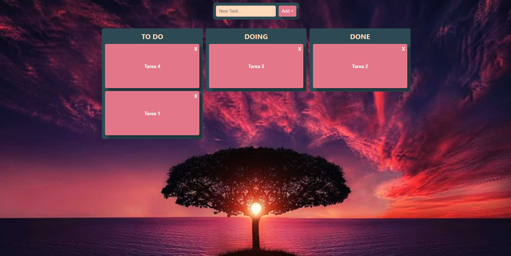

# Proyecto Kanban Board con ReactJS

El siguiente proyecto sirve como ejemplo de desarrollo de un Kanban Board con ReactJS. Se construyó un tablero con 3 secciones: TO DO, DOING, DONE con las siguientes caracteristicas:

* Cada seccion puede contener *tareas*.
* Cada *tarea* puede ser reordenada dentro de su misma seccion o moverse a otra.
* Las *tareas* pueden ser eliminadas como tambien se pueden agregar nuevas. 
* También se implementó el uso de localStorage para que el tablero sea persistente y no se pierdan las tareas por algún refresh no deseado de la página.
* No se utilizo ninguna libreria para el manejo de *drag and drop*.
* Se utilizo useContext para un acceso global a las funcionalidades del tablero.
* Diseño responsive para una correcta visualización en distintos dispositivos.
